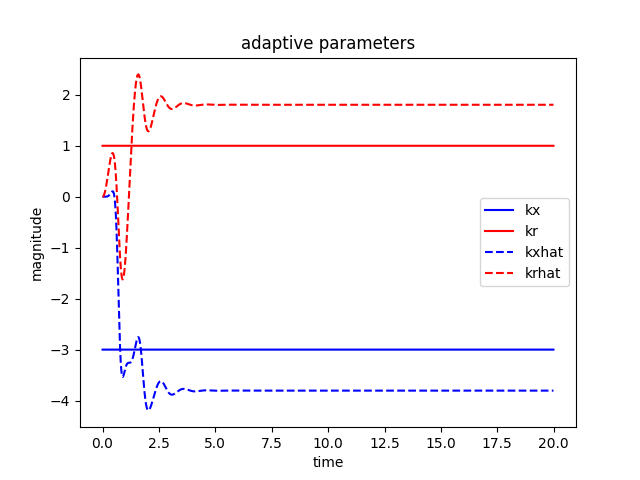

# Adaptive Control
Adaptive control is a control method where a controller's parameters changes or are initially uncertain to keep the system stable. One example is the weight of a vehicle changes as fuel is consumed. Adaptive control is different from robust control where extra margins is reserved for changes in the system so they system has some leeway before going unstable.

# Model Reference Adaptive Control
\
An example of adaptive control where it uses a reference model to define a desired closed loop response. The unknown/uncertain/changing plant is compared to the reference model and the gains are adapted to the system.

# Lyapunov Stability
For an autonomous (does not explicit depend on time variable/time invariant system) non linear dynamical system

$$\dot x = f(x(t)), x(0) = x_0$$

1. A system is lyapunov stable if the solutions starting close to the equilibrium remains close enough forever.
2. A system is asymptotic stable if the solutions that start close to the equilibrium converges to the equilibrium.
3. A system is exponentially stable if the solutions converges at an exponential rate to the equilibrium.

# Lyapunov Function
Choosing a function with a certain form so Barbalat's lemma can be used to prove stability. A Lyapunov function $V(x)$ 

* $V(x) = 0$ if and only if $x = 0$
* $V(x) > 0$ if and only if $x != 0$
* $\dot V(x) < 0$ for $x != 0$

# Barbalat's Lemma
If $f(t)$ has a finite limit as t -> $\infin$ and if $\dot f$ is uniformly continuous (or $\ddot f$ is bounded), then $\dot f(t)$ -> 0 as t -> $\infin$.

Using Barbalat's lemma on a Lyapunov function
If $V(x)$ has a finite limit as t -> $\infin$ and $\dot V(x)$ is uniformly continuous if $\ddot V(x)$ is bounded, then $\dot V(x)$ -> 0 as t -> $\infin$ then e(t) -> 0. Tracking error is asymptotically stable.

# Stability Proof

* r(t) is the reference input
* $K_x$ is the feedback gain
* $K_r$ is the feedforward gain
* $\hat K_x$ is the estimated feedback gain
* $\hat K_r$ is the estimated feedforward gain
* $\tilde K_x = \hat K_x - K_x$ 
* $\tilde K_r = \hat K_r - K_r$
* $x_m$ is the ref model states
* $x$ is the plant model states
* $e$ is the error between the models
* $u$ is the controller output
* $w$ are the disturbance basis weights
* $\phi(x)$ are the disturbance basis functions 

Open loop plant model state space equation

$$\dot{x} = A x + B u$$

Reference model state space equation

$$\dot{x_m} = A_m x_m + B_m r$$

Control law is defined as

$$u = \hat{k_x} x + \hat{k_r} r$$

Substitute u into open loop to get the closed loop state space equation 

$$\dot{x} = Ax + B(\hat{k_x}x + \hat{k_r}r)$$

$$\dot{x} = Ax + B \hat{k_x}x + B \hat{k_r}r$$

$$\dot{x} = (A+B \hat{k_x})x + B \hat{k_r}r$$

The uncertain plant would behave the same as the reference model if model matching conditions are met.

$$A_m = A + B \hat{k_x}$$

$$B_m = B \hat{k_r}$$

error is defined to be

$$e = x_m - x$$

$$\dot{e} = \dot{x_m} - \dot{x}$$

Substituting in the model equations

$$\dot{e} = A_m x_m + B_m r - (A + B \hat{k_x})x - B \hat{k_r} r$$

$$\dot{e} = A_m x_m + B_m r - (A + B \hat{k_x})x - B \hat{k_r} r + A_m x - A_m x$$

Substituting Ideal matching conditions

$$A_m = A + B k_x$$

$$B_m = B k_r$$

Becomes

$$\dot{e} = A_m x_m - A_m x + B k_r r - Ax - B \hat{k_x} x - B \hat{k_r} r + (A + B k_x)x$$

$$\dot{e} = A_m x_m - A_m x - B \hat{k_x} x + B k_x x - B \hat{k_r} r + B k_r r$$

$$\dot{e} = A_m e - B(\hat{k_x} - k_x)x - B(\hat{k_r} - k_r)r$$

$$\dot{e} = A_m e - B\tilde{k_x}x - B\tilde{k_r}r$$

The chosen Lyapunov function is

$$V = e^T P e + |b|(\tilde{k_x} \Gamma_x^{-1} \dot{\tilde{k_x^T}} + \frac{1}{\gamma_r}\tilde{k_r^2})$$

$\Gamma$ and P are constant matrix that are also positive definite and diagonal. $(abc)^T = c^T b^T a^T$

$$\dot{V} = \dot{e^T} P e + e^T P \dot{e} + |b|(\dot{\tilde{k_x}} \Gamma_x^{-1} \tilde{k_x^T} + \tilde{k_x^T} \Gamma_x^{-1} \dot{\tilde{k_x^T}} + \frac{2}{\gamma_r} \tilde{k_r} \dot{\tilde{k_r}})$$

Substituting $\dot e$ becomes

$$\dot{V} = (e^T A_m^T - x^T \tilde{k_x^T} B^T - r^T \tilde{k_r^T} B^T)Pe + e^T P(A_m e - B \tilde{k_x} x - B \tilde{k_r} r) + |b|(2 \tilde{k_x} \Gamma_x^{-1} \dot{\tilde{k_x^T}} + \frac{2}{\gamma_r} \tilde{k_r} \dot{\tilde{k_r}})$$

Lyapunov equation $AP + PA^T + Q = 0$

$$\dot{V} = e^T A_m^T P e + e^T P A_m e + (-x^T \tilde{k_x^T} B^T - r^T \tilde{k_r^T} B^T)Pe + e^T P(-B \tilde{k_x} x - B \tilde{k_r} r) + |b|(2 \tilde{k_x} \Gamma_x^{-1} \dot{\tilde{k_x^T}} + \frac{2}{\gamma_r} \tilde{k_r} \dot{\tilde{k_r}})$$

$$\dot{V} = e^T(A_m^T P + P A_m)e + 2 e^T P B(-\tilde{k_x} x - \tilde{k_r} r) + |b|(2 \tilde{k_x} \Gamma_x^{-1} \dot{\tilde{k_x^T}} + \frac{2}{\gamma_r} \tilde{k_r} \dot{\tilde{k_r}})$$

Can see $A = A_m^T$, let $PB = \bar{P}b$ where $\bar{P} = [P_{12} P_{22}]^T$

$$\dot{V} = -e^T Q e + 2|b|sign(b)(-\tilde{k_x} x - \tilde{k_r} r)e^T \bar{P} + |b|(2 \tilde{k_x} \Gamma_x^{-1} \dot{\tilde{k_x^T}} + \frac{2}{\gamma_r} \tilde{k_r} \dot{\tilde{k_r}})$$

$$\dot{V} = -e^T Q e + 2|b| \tilde{k_x}(-x e^T \bar{P} sign(b) + \Gamma_x^{-1} \dot{\tilde{k_x^T}}) + 2|b| \tilde{k_r}(-r e^T \bar{P} sign(b) + \frac{1}{\gamma_r}\dot{\tilde{k_r}})$$

Adaptive laws are chosen to be

$$\dot{\tilde{k_x^T}} = \Gamma_x x e^T \bar{P} sign(b)$$

$$\dot{\tilde{k_r}} = \gamma_r r e^T \bar{P} sign(b)$$

So all the positive parts can cancel out and the equation becomes

$$\dot{V}(e,\tilde{k_x},\tilde{k_r}) = -e^T Q e, ||e||^2 \leq 0$$

Since $V$ is lower bounded, $\dot{V}$ is negative semi-definite $\ddot{V}$ is bounded, therefore $\dot{V}$ is uniformly continuous. By Barbalat's lemma $\dot{V}$ -> 0 as t -> $\infin$, therefore e(t) -> 0 as t-> $\infin$. The tracking error is asymptotically stable.

# Plots
First order SISO\
\
Can see the plant state x follow the reference model state x

\
Can see that the estimated kx feedback gain is trying to converge to the actual kx. Can also see that the estimated kr feedforward gain is converging too. 

Second order SISO\
\
Can see the plant states x1 (position) and x2 (velocity) is following the reference model states xm1 and xm2.

\
Can see that the estimated kx and kr gains trying to converge to the actual kx and kr gains. MRAC does not guarantee parameter convergence, MRAC only guarantees plant and reference plant convergence. Persistance excitation helps the results of MRAC.

# References
Model-Reference Adaptive Control: A Primer by Nguyen, Nhan T.
